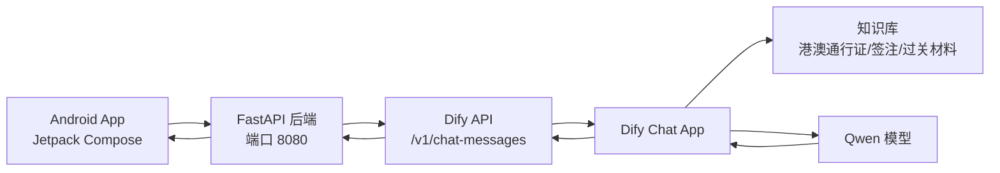

# Phase 04：后端网关与 Android 前端通信打通阶段

> 项目：粤同心-湾区中老年助手
> 阶段定位：在已完成 Dify 部署、知识库问答、Dify API 测通、Android 静态 UI 还原的基础上，进入“后端封装 + 前端真实联调”的新阶段。
> 版本日期：2026-05-24
> 重要安全提醒：此前测试过程中 Dify App API Key 已经出现在调试文本中，建议立即在 Dify「API 访问」页面删除旧 Key，并重新生成新 Key。后续所有文档、代码、截图均只使用占位符，不写真实 Key。

---

## 1. 当前项目总结

### 1.1 当前已经完成的内容

当前项目已经从“方案设计”推进到了“真实 RAG 问答链路已跑通”的状态。

已完成内容包括：

1. **Dify 自部署完成**
   - 已在 Ubuntu VM 中完成 Docker 安装。
   - 已解决 Docker Hub 拉镜像失败问题，配置了镜像源。
   - 已解决 VM 扩容后根分区/LVM 未完全使用 40GB 的问题。
   - Dify 服务已能通过浏览器访问并完成初始化。

2. **模型与知识库配置完成**
   - Dify 中已配置通义/Qwen 模型供应商。
   - 已创建聊天助手应用。
   - 已创建“粤同心政策知识库”。
   - 已上传港澳通行证、签注、赴港赴澳过关材料相关 Markdown 文档。
   - 已发布 Dify 应用。

3. **Dify RAG API 已测通**
   - 已通过 `curl` 调用 Dify `/v1/chat-messages` 接口。
   - 返回结果中包含：
     - `answer`
     - `conversation_id`
     - `retriever_resources`
     - `usage`
   - `retriever_resources` 能命中知识库文档，说明当前问答已经走了 RAG 检索，而不是纯模型生成。

4. **Android UI 静态还原已完成**
   - 首页 / 智能助手页已完成静态还原。
   - 字体大小选择页已完成静态还原。
   - 材料清单事项选择页已完成静态还原。
   - 操作指南第 1 步已完成静态还原。
   - Android 项目已能 `assembleDebug` 成功。
   - 当前 Android 仍为静态 UI 和基础跳转，尚未接入后端接口。

---

### 1.2 当前尚未完成的内容

当前还没有完成：

1. Android App 调用真实后端。
2. FastAPI 后端网关。
3. 后端封装 Dify API。
4. Android 发送用户问题并展示真实 AI 回答。
5. 材料清单真实生成逻辑。
6. 语音输入、语音识别、语音播报。
7. 文件上传材料检查。
8. 云端部署与公网访问。
9. API Key 安全管理。
10. 错误处理、超时处理、loading 状态与失败兜底。

因此，本阶段的目标不是继续补页面，而是进入**真实接口联调**。

---

## 2. 本阶段目标

### 2.1 阶段名称

**Phase 04：后端网关与 Android 前端通信打通阶段**

### 2.2 阶段核心目标

本阶段要完成一个最小但真实的通信闭环：

```text
Android App
  ↓
FastAPI 后端
  ↓
Dify App API
  ↓
Dify 知识库 + Qwen
  ↓
FastAPI 后端
  ↓
Android App 展示回答
```

### 2.3 本阶段验收标准

当用户在 Android App 首页输入：

```text
港澳通行证续签需要什么材料？
```

点击发送后，App 应该能够：

1. 显示 loading 状态。
2. 调用后端 `/api/v1/chat-policy`。
3. 后端调用 Dify `/v1/chat-messages`。
4. 后端只提取 Dify 返回中的 `answer` 和必要元信息。
5. Android 展示回答内容。
6. 如果请求失败，Android 展示适合中老年用户理解的错误提示。

---

## 3. 当前推荐架构

### 3.1 为什么不能让 Android 直接调用 Dify

不建议：

```text
Android App → Dify API
```

原因：

1. Dify API Key 会被打包进 APK，存在泄露风险。
2. Android 端难以统一处理限流、错误、日志和脱敏。
3. 后续接语音识别、文件上传、材料清单、表单预填时，需要一个统一业务层。
4. 如果 Dify 地址、API Key、应用类型变更，Android 需要重新发版。

推荐：

```text
Android App → FastAPI 后端 → Dify API
```

这样 Android 只认识自己的后端，不关心 Dify 内部怎么换。

---

### 3.2 本阶段最小架构图



---

## 4. 环境变量设计

后端不要把敏感信息写死在代码中。建议在 `backend/.env` 中配置：

```env
# FastAPI
APP_ENV=dev
APP_NAME=YueTongXin Backend
APP_HOST=0.0.0.0
APP_PORT=8080

# Dify
DIFY_BASE_URL=http://localhost
DIFY_API_KEY=app-替换为新的DifyAppKey
DIFY_CHAT_PATH=/v1/chat-messages

# Request
DIFY_TIMEOUT_SECONDS=60

# Demo
DEFAULT_USER_ID=demo-user-001
```

如果 FastAPI 后端和 Dify 不在同一台机器，例如后端在 Windows，本地 Dify 在 VM：

```env
DIFY_BASE_URL=http://192.168.221.131
```

如果 FastAPI 和 Dify 在同一台 VM：

```env
DIFY_BASE_URL=http://localhost
```

---

## 5. 后端项目结构建议

在当前总项目中新增或补齐：

```text
backend/
├── requirements.txt
├── .env.example
├── app/
│   ├── main.py
│   ├── config.py
│   ├── api/
│   │   ├── routes_health.py
│   │   └── routes_chat.py
│   ├── services/
│   │   └── dify_service.py
│   ├── schemas/
│   │   └── chat_schema.py
│   └── core/
│       └── errors.py
└── README.md
```

---

## 6. 后端接口设计

### 6.1 健康检查接口

#### 请求

```http
GET /health
```

#### 响应

```json
{
  "status": "ok",
  "service": "yue-tongxin-backend"
}
```

---

### 6.2 政策问答接口

#### 请求

```http
POST /api/v1/chat-policy
Content-Type: application/json
```

#### 请求体

```json
{
  "message": "港澳通行证续签需要什么材料？",
  "session_id": "sess_001",
  "conversation_id": "",
  "user_id": "demo-user-001"
}
```

#### 字段说明

| 字段 | 类型 | 必填 | 说明 |
|---|---|---:|---|
| message | string | 是 | 用户输入的问题 |
| session_id | string | 否 | App 本地会话 ID，Demo 可固定 |
| conversation_id | string | 否 | Dify 返回的多轮会话 ID，首轮为空 |
| user_id | string | 否 | 用户标识，Demo 可固定 |

#### 响应体

```json
{
  "answer": "办理港澳通行证续签，通常是再次办理赴港或赴澳签注……",
  "conversation_id": "97e020aa-9b1b-4000-8448-1f54ceca4d13",
  "sources": [
    {
      "document_name": "02_港澳签注办理与续签说明.md",
      "score": 0.65,
      "content": "日常说的“续签”多数是再次办理赴香港或赴澳门签注..."
    }
  ],
  "usage": {
    "total_tokens": 1283,
    "latency": 18.07
  }
}
```

#### App 端最少只需要使用

```json
{
  "answer": "...",
  "conversation_id": "..."
}
```

`sources` 和 `usage` 可以先打印日志，后续用于答辩展示“基于知识库检索”。

---

## 7. 后端最小代码示例

### 7.1 requirements.txt

```txt
fastapi==0.115.0
uvicorn[standard]==0.30.6
httpx==0.27.2
python-dotenv==1.0.1
pydantic==2.8.2
pydantic-settings==2.4.0
```

---

### 7.2 app/config.py

```python
from pydantic_settings import BaseSettings


class Settings(BaseSettings):
    app_name: str = "YueTongXin Backend"
    app_env: str = "dev"

    dify_base_url: str
    dify_api_key: str
    dify_chat_path: str = "/v1/chat-messages"
    dify_timeout_seconds: int = 60

    default_user_id: str = "demo-user-001"

    class Config:
        env_file = ".env"
        env_file_encoding = "utf-8"


settings = Settings()
```

---

### 7.3 app/schemas/chat_schema.py

```python
from typing import Any
from pydantic import BaseModel, Field


class ChatPolicyRequest(BaseModel):
    message: str = Field(..., min_length=1, description="用户输入的问题")
    session_id: str | None = Field(default=None)
    conversation_id: str | None = Field(default="")
    user_id: str | None = Field(default=None)


class SourceItem(BaseModel):
    document_name: str | None = None
    score: float | None = None
    content: str | None = None


class ChatPolicyResponse(BaseModel):
    answer: str
    conversation_id: str | None = ""
    sources: list[SourceItem] = []
    usage: dict[str, Any] = {}
```

---

### 7.4 app/services/dify_service.py

```python
import httpx
from app.config import settings


class DifyService:
    def __init__(self) -> None:
        self.base_url = settings.dify_base_url.rstrip("/")
        self.api_key = settings.dify_api_key
        self.chat_url = f"{self.base_url}{settings.dify_chat_path}"

    async def send_chat_message(
        self,
        message: str,
        conversation_id: str = "",
        user_id: str = "demo-user-001",
    ) -> dict:
        headers = {
            "Authorization": f"Bearer {self.api_key}",
            "Content-Type": "application/json",
        }

        payload = {
            "inputs": {},
            "query": message,
            "response_mode": "blocking",
            "conversation_id": conversation_id or "",
            "user": user_id,
        }

        timeout = httpx.Timeout(settings.dify_timeout_seconds)

        async with httpx.AsyncClient(timeout=timeout) as client:
            resp = await client.post(self.chat_url, headers=headers, json=payload)
            resp.raise_for_status()
            return resp.json()


dify_service = DifyService()
```

---

### 7.5 app/api/routes_health.py

```python
from fastapi import APIRouter

router = APIRouter()


@router.get("/health")
async def health():
    return {
        "status": "ok",
        "service": "yue-tongxin-backend"
    }
```

---

### 7.6 app/api/routes_chat.py

```python
from fastapi import APIRouter, HTTPException
from app.config import settings
from app.schemas.chat_schema import ChatPolicyRequest, ChatPolicyResponse, SourceItem
from app.services.dify_service import dify_service

router = APIRouter(prefix="/api/v1", tags=["chat"])


@router.post("/chat-policy", response_model=ChatPolicyResponse)
async def chat_policy(req: ChatPolicyRequest):
    try:
        user_id = req.user_id or settings.default_user_id

        dify_result = await dify_service.send_chat_message(
            message=req.message,
            conversation_id=req.conversation_id or "",
            user_id=user_id,
        )

        answer = dify_result.get("answer", "")
        conversation_id = dify_result.get("conversation_id", "")

        metadata = dify_result.get("metadata") or {}
        retriever_resources = metadata.get("retriever_resources") or []

        sources = [
            SourceItem(
                document_name=item.get("document_name"),
                score=item.get("score"),
                content=item.get("content"),
            )
            for item in retriever_resources
        ]

        usage = metadata.get("usage") or {}

        return ChatPolicyResponse(
            answer=answer,
            conversation_id=conversation_id,
            sources=sources,
            usage=usage,
        )

    except Exception as e:
        raise HTTPException(
            status_code=502,
            detail=f"Dify 服务调用失败：{str(e)}"
        )
```

---

### 7.7 app/main.py

```python
from fastapi import FastAPI
from app.api.routes_health import router as health_router
from app.api.routes_chat import router as chat_router

app = FastAPI(
    title="YueTongXin Backend",
    description="粤同心-湾区中老年助手后端网关",
    version="0.1.0",
)

app.include_router(health_router)
app.include_router(chat_router)
```

---

## 8. 后端启动与测试

### 8.1 本地启动

```bash
cd backend

python -m venv .venv
source .venv/bin/activate

pip install -r requirements.txt

uvicorn app.main:app --reload --host 0.0.0.0 --port 8080
```

Windows PowerShell：

```powershell
cd backend

python -m venv .venv
.\.venv\Scripts\Activate.ps1

pip install -r requirements.txt

uvicorn app.main:app --reload --host 0.0.0.0 --port 8080
```

---

### 8.2 测试健康检查

```bash
curl http://localhost:8080/health
```

期望：

```json
{
  "status": "ok",
  "service": "yue-tongxin-backend"
}
```

---

### 8.3 测试政策问答

```bash
curl -X POST "http://localhost:8080/api/v1/chat-policy" \
  -H "Content-Type: application/json" \
  -d '{
    "message": "港澳通行证续签需要什么材料？",
    "conversation_id": "",
    "user_id": "demo-user-001"
  }'
```

期望：

```json
{
  "answer": "……",
  "conversation_id": "……",
  "sources": [
    {
      "document_name": "02_港澳签注办理与续签说明.md",
      "score": 0.65,
      "content": "……"
    }
  ],
  "usage": {
    "total_tokens": 1283,
    "latency": 18.07
  }
}
```

---

## 9. Android 前端接入设计

### 9.1 Android 当前状态

当前 Android 已完成静态页面：

1. 首页
2. 字体页
3. 材料清单事项选择页
4. 操作指南第 1 步

但尚未实现：

1. 网络请求层
2. ViewModel 状态管理
3. 真实问答提交
4. AI 回答展示
5. loading / error 状态

因此本阶段需要补齐：

```text
api/
model/
viewmodel/
UI 状态绑定
```

---

### 9.2 Android 网络配置

#### AndroidManifest.xml

如果后端是 HTTP，而不是 HTTPS，开发阶段需要允许明文流量：

```xml
<uses-permission android:name="android.permission.INTERNET" />

<application
    android:usesCleartextTraffic="true">
</application>
```

后续正式云端部署最好改为 HTTPS。

---

### 9.3 Android 访问地址选择

不同运行环境，`BASE_URL` 不一样。

#### 情况 A：Android 模拟器访问电脑本机 FastAPI

如果 FastAPI 跑在开发电脑本机：

```kotlin
const val BASE_URL = "http://10.0.2.2:8080/"
```

Android 模拟器里的 `10.0.2.2` 代表宿主机。

#### 情况 B：Android 真机访问同一局域网电脑 FastAPI

查电脑局域网 IP，例如：

```text
192.168.1.23
```

Android 使用：

```kotlin
const val BASE_URL = "http://192.168.1.23:8080/"
```

手机和电脑必须在同一个 Wi-Fi 下。

#### 情况 C：Android 访问 VM 中的 FastAPI

如果 FastAPI 跑在 VM，且 VM IP 是：

```text
192.168.221.131
```

Android 使用：

```kotlin
const val BASE_URL = "http://192.168.221.131:8080/"
```

前提是手机/宿主机能访问这个 VM IP。若该 IP 是仅主机模式地址，真机可能访问不了，需要改桥接网络或部署到云服务器。

#### 情况 D：云端部署

例如腾讯云服务器公网 IP：

```text
http://服务器公网IP:8080/
```

Android 使用：

```kotlin
const val BASE_URL = "http://服务器公网IP:8080/"
```

正式展示建议配置域名和 HTTPS。

---

## 10. Android Retrofit 最小代码

### 10.1 build.gradle.kts 依赖

在 `app/build.gradle.kts` 中加入：

```kotlin
dependencies {
    implementation("com.squareup.retrofit2:retrofit:2.11.0")
    implementation("com.squareup.retrofit2:converter-gson:2.11.0")
    implementation("com.squareup.okhttp3:logging-interceptor:4.12.0")
}
```

如果项目已使用 Kotlin Serialization，也可以不用 Gson，保持当前项目风格即可。

---

### 10.2 ChatModels.kt

```kotlin
package com.example.elderlyassistant.model

data class ChatPolicyRequest(
    val message: String,
    val session_id: String? = null,
    val conversation_id: String? = "",
    val user_id: String? = "demo-user-001"
)

data class SourceItem(
    val document_name: String? = null,
    val score: Double? = null,
    val content: String? = null
)

data class ChatPolicyResponse(
    val answer: String,
    val conversation_id: String? = "",
    val sources: List<SourceItem> = emptyList()
)
```

---

### 10.3 AssistantApi.kt

```kotlin
package com.example.elderlyassistant.api

import com.example.elderlyassistant.model.ChatPolicyRequest
import com.example.elderlyassistant.model.ChatPolicyResponse
import retrofit2.http.Body
import retrofit2.http.GET
import retrofit2.http.POST

interface AssistantApi {
    @GET("health")
    suspend fun health(): Map<String, String>

    @POST("api/v1/chat-policy")
    suspend fun chatPolicy(
        @Body request: ChatPolicyRequest
    ): ChatPolicyResponse
}
```

---

### 10.4 ApiClient.kt

```kotlin
package com.example.elderlyassistant.api

import okhttp3.OkHttpClient
import okhttp3.logging.HttpLoggingInterceptor
import retrofit2.Retrofit
import retrofit2.converter.gson.GsonConverterFactory
import java.util.concurrent.TimeUnit

object ApiClient {
    // 开发阶段按实际环境修改：
    // 模拟器访问电脑本机： http://10.0.2.2:8080/
    // 真机访问局域网： http://192.168.1.xxx:8080/
    // VM： http://192.168.221.131:8080/
    private const val BASE_URL = "http://10.0.2.2:8080/"

    private val logging = HttpLoggingInterceptor().apply {
        level = HttpLoggingInterceptor.Level.BODY
    }

    private val okHttpClient = OkHttpClient.Builder()
        .connectTimeout(15, TimeUnit.SECONDS)
        .readTimeout(70, TimeUnit.SECONDS)
        .writeTimeout(30, TimeUnit.SECONDS)
        .addInterceptor(logging)
        .build()

    val assistantApi: AssistantApi by lazy {
        Retrofit.Builder()
            .baseUrl(BASE_URL)
            .client(okHttpClient)
            .addConverterFactory(GsonConverterFactory.create())
            .build()
            .create(AssistantApi::class.java)
    }
}
```

---

## 11. Android ViewModel 状态设计

### 11.1 ChatUiState.kt

```kotlin
package com.example.elderlyassistant.viewmodel

data class ChatUiState(
    val input: String = "",
    val answer: String = "",
    val conversationId: String = "",
    val isLoading: Boolean = false,
    val errorMessage: String? = null
)
```

---

### 11.2 ChatViewModel.kt

```kotlin
package com.example.elderlyassistant.viewmodel

import androidx.lifecycle.ViewModel
import androidx.lifecycle.viewModelScope
import com.example.elderlyassistant.api.ApiClient
import com.example.elderlyassistant.model.ChatPolicyRequest
import kotlinx.coroutines.flow.MutableStateFlow
import kotlinx.coroutines.flow.StateFlow
import kotlinx.coroutines.launch

class ChatViewModel : ViewModel() {
    private val _uiState = MutableStateFlow(ChatUiState())
    val uiState: StateFlow<ChatUiState> = _uiState

    fun updateInput(value: String) {
        _uiState.value = _uiState.value.copy(input = value)
    }

    fun sendQuestion() {
        val question = _uiState.value.input.trim()
        if (question.isEmpty()) {
            _uiState.value = _uiState.value.copy(
                errorMessage = "请先输入您想咨询的问题"
            )
            return
        }

        _uiState.value = _uiState.value.copy(
            isLoading = true,
            errorMessage = null
        )

        viewModelScope.launch {
            try {
                val current = _uiState.value

                val response = ApiClient.assistantApi.chatPolicy(
                    ChatPolicyRequest(
                        message = question,
                        conversation_id = current.conversationId,
                        user_id = "demo-user-001"
                    )
                )

                _uiState.value = current.copy(
                    answer = response.answer,
                    conversationId = response.conversation_id.orEmpty(),
                    isLoading = false,
                    errorMessage = null
                )

            } catch (e: Exception) {
                _uiState.value = _uiState.value.copy(
                    isLoading = false,
                    errorMessage = "系统暂时没有响应，请稍后再试，或换个问题重新发送。"
                )
            }
        }
    }

    fun clearError() {
        _uiState.value = _uiState.value.copy(errorMessage = null)
    }
}
```

---

## 12. Android UI 接入点

当前首页已有：

1. 输入框
2. 发送按钮
3. 常见问题卡片
4. 语音提问按钮

本阶段先接两个入口：

### 12.1 输入框 + 发送按钮

交互：

```text
用户输入问题
→ 发送按钮变为可用
→ 点击发送
→ 调用 ViewModel.sendQuestion()
→ 显示 loading
→ 显示 answer
```

### 12.2 常见问题点击

交互：

```text
用户点击“如何申请港澳通行证？”
→ 自动把问题填入输入框
→ 可立即发送，或自动触发 sendQuestion()
```

推荐 Demo 阶段点击 FAQ 后直接触发问答，减少操作步骤。

### 12.3 语音按钮暂时处理

本阶段不要接真实语音。先保留按钮，并提示：

```text
语音功能下一阶段接入，现在请先使用文字输入。
```

---

## 13. 前后端联调步骤

### Step 1：确认 Dify API 仍可用

在 Dify 所在机器执行：

```bash
curl -X POST "http://localhost/v1/chat-messages" \
  -H "Authorization: Bearer app-新的DifyKey" \
  -H "Content-Type: application/json" \
  -d '{
    "inputs": {},
    "query": "港澳通行证续签需要什么材料？",
    "response_mode": "blocking",
    "conversation_id": "",
    "user": "test-user-001"
  }'
```

能返回 `answer` 即可。

---

### Step 2：启动 FastAPI

```bash
cd backend
uvicorn app.main:app --reload --host 0.0.0.0 --port 8080
```

---

### Step 3：测试 FastAPI 健康检查

```bash
curl http://localhost:8080/health
```

---

### Step 4：测试 FastAPI 调 Dify

```bash
curl -X POST "http://localhost:8080/api/v1/chat-policy" \
  -H "Content-Type: application/json" \
  -d '{
    "message": "港澳通行证续签需要什么材料？",
    "conversation_id": "",
    "user_id": "demo-user-001"
  }'
```

---

### Step 5：确认 Android 能访问后端

如果用模拟器，先在模拟器浏览器打开：

```text
http://10.0.2.2:8080/health
```

如果用真机，打开：

```text
http://电脑或VM的局域网IP:8080/health
```

能看到 `status: ok` 后，再接 Retrofit。

---

### Step 6：Android 输入问题测试

在 App 输入：

```text
港澳通行证续签需要什么材料？
```

期望：

1. 按钮可点击。
2. 页面出现“正在查询，请稍候……”。
3. 15～60 秒内返回回答。
4. 回答展示在 AI 回复卡片中。
5. 如果失败，显示友好错误文案。

---

## 14. 错误处理建议

### 14.1 后端错误

| 场景 | 后端处理 |
|---|---|
| Dify 连接失败 | 返回 502 |
| Dify 超时 | 返回 504 或 502 |
| Dify 返回非 JSON | 返回 502 |
| 用户 message 为空 | 返回 422 |
| Dify API Key 无效 | 返回 502，并在日志提示鉴权失败 |

### 14.2 Android 错误提示

不要展示技术错误，如：

```text
HTTP 502 Bad Gateway
java.net.SocketTimeoutException
```

应该展示：

```text
系统暂时没有响应，请稍后再试。
```

或：

```text
网络好像不太稳定，请检查网络后再试一次。
```

---

## 15. 回答质量优化建议

当前 Dify 回答已经能命中知识库，但存在两个问题：

1. 回答偏长。
2. 个别细节可能补充了知识库中未明确写出的内容。

建议在 Dify 提示词中加入：

```text
每次回答控制在 300 字以内，除非用户要求详细说明。

如果知识库没有明确依据，不要自行补充具体数字、费用、时限或限制条件。

回答必须区分：
- 必备材料
- 建议携带材料
- 注意事项

不要使用绝对化表述，例如“一定可以”“肯定可以”“不能代办”。
应改为“一般可以”“通常需要”“部分情况可能需要人工窗口办理”。

回答末尾简短标注：资料依据：知识库中的相关官方指南/政策说明。
```

---

## 16. 本阶段任务清单

### 16.1 后端任务

- [ ] 创建 `backend/` 项目结构。
- [ ] 编写 `.env.example`。
- [ ] 实现 `/health`。
- [ ] 实现 DifyService。
- [ ] 实现 `/api/v1/chat-policy`。
- [ ] 使用 curl 测试后端调用 Dify。
- [ ] 增加错误处理。
- [ ] 增加日志输出。
- [ ] 确认不会在日志中打印完整 Dify API Key。

### 16.2 Android 任务

- [ ] 添加网络权限。
- [ ] 开发阶段允许明文 HTTP。
- [ ] 添加 Retrofit / OkHttp 依赖。
- [ ] 新增 `ApiClient.kt`。
- [ ] 新增 `AssistantApi.kt`。
- [ ] 新增 `ChatModels.kt`。
- [ ] 新增 `ChatViewModel.kt`。
- [ ] 首页输入框绑定 ViewModel。
- [ ] 发送按钮调用接口。
- [ ] 显示 loading。
- [ ] 显示回答。
- [ ] 显示错误提示。
- [ ] FAQ 点击后触发问答。

### 16.3 Dify 任务

- [ ] 重新生成 Dify API Key。
- [ ] 确认应用已发布。
- [ ] 确认知识库已绑定。
- [ ] 优化提示词，限制回答长度。
- [ ] 测试 5 个固定问题。
- [ ] 保留 API 调用成功截图/日志，但不要露出 Key。

---

## 17. 推荐测试问题

用于 Dify、后端、Android 三层一致性测试：

```text
港澳通行证怎么办？
```

```text
港澳通行证续签需要什么材料？
```

```text
老人去香港过关要带什么？
```

```text
只有澳门签注可以去香港吗？
```

```text
去香港和澳门都玩，需要几个签注？
```

预期效果：

1. 回答能结合知识库。
2. 回答不编造过多细节。
3. 回答对中老年用户友好。
4. 回答长度适合手机屏幕阅读。
5. 回答能区分香港签注和澳门签注。

---

## 18. 本阶段完成后的下一阶段建议

### Phase 05：材料清单真实生成

目标：

```text
用户点击“材料清单”
→ 选择事项
→ 后端返回结构化材料清单
→ Android 展示可勾选清单
→ 用户可保存到“我的材料清单”
```

优先事项：

1. 办理港澳通行证
2. 港澳通行证续签
3. 过关材料准备

建议接口：

```http
GET /api/v1/materials/items
GET /api/v1/materials/{item_code}
POST /api/v1/materials/save
```

---

### Phase 06：语音输入与语音播报

目标：

```text
用户点击语音提问
→ App 录音
→ 后端调用 ASR
→ 转文字
→ 调用政策问答
→ App 展示答案
→ Android TTS 播放答案
```

建议先使用 Android 本地 TextToSpeech 做播报，ASR 可后接腾讯云或阿里云。

---

### Phase 07：文件上传与材料检查

目标：

```text
用户上传材料图片/文档
→ 后端保存或转发给 Dify Chatflow
→ Dify 提取材料信息
→ 对照知识库材料清单
→ 返回缺失项
```

这个阶段适合放在答辩“未来拓展”中，不建议抢在前后端联调前做。

---

## 19. 当前阶段一句话总结

当前项目已经完成 Dify/RAG 能力验证和 Android 静态 UI 还原，下一步应集中火力完成 FastAPI 后端网关与 Android 前端通信打通。只要 `/api/v1/chat-policy` 能稳定返回 Dify 知识库问答结果，整个项目就从“页面原型 + AI 平台验证”进入“可运行 App Demo”阶段。
