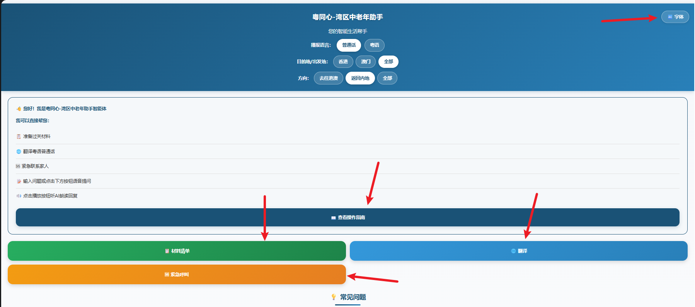
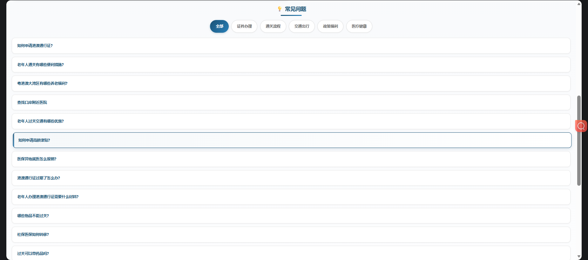
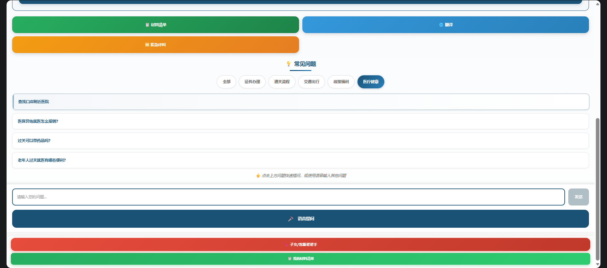

# 最小交付方案

按照 “通关前——通关中——通关后” 三个阶段板块功能构建。

## 首页板块

- 建议：
  - 不要做成长条。像小程序一样把功能分到 **底栏** 或 **侧边栏** 更符合用户习惯。
  - 或者把功能做成大卡片组合展示在首页，然后进行功能跳转。

---



- 字体部分：根据选项调整页面字体
- 静态页面展示：查看操作指南、材料清单、翻译、紧急呼叫。——即与灵光演示一致，只展示内容，不对内容进行处理。

* 建议：
  - 朗读可以改为在每一段文字后面加小喇叭。不需要复制进去。

| 内容类型   | 示例                                   | 推荐朗读方式                     |
| ---------- | -------------------------------------- | -------------------------------- |
| 静态资料   | 办理指南、材料清单、常见步骤、温馨提示 | 预生成 mp3/wav，App 直接播放     |
| 半动态内容 | 用户个人方案模板、常见 FAQ 回答        | 可以缓存生成后的音频             |
| 动态内容   | RAG 即时回答、用户专属方案             | 调用 TTS API 或 Android 本地 TTS |
| 确认提示   | “我听到的是……” “请确认是否正确”        | Android 本地 TTS                 |

---


说明：对问题方面，仅仅进行静态页面展示。详细同上。并且根据内容适当进行缩减：即仅仅对前面问题进行演示。

- 建议：
  - 不需要一下展示这么多问题。可以进行卡片折叠。

---



- 可以：
  - 对对话框输入问题，调用 Dify 进行 RAG 处理后进行生成。
  - 加入语音输入功能。拓展：对用户对话内容进行确认，再打到RAG里面。然后给出：
    - [正确，继续]
      [重新说一遍]
      [手动修改]
      [朗读这句话]
    - 实际（以Cantonese为例）应该将输入音频转文字进行确认，然后在后端转义成普通话文本（Qwen-MT翻译模型），再给RAG进行检索。不能直接把ASR的text，例如粤语的文本直接给RAG。
  - 加入回答朗读。

| 模型类型 | 英文                 | 输入              | 输出                  | 例子                                |
| -------- | -------------------- | ----------------- | --------------------- | ----------------------------------- |
| 语音识别 | ASR / Speech to Text | 音频文件 / 录音流 | 文字                  | 用户说粤语 → “我个签注过咗期”       |
| 翻译模型 | MT / Translation     | 文字              | 另一种语言/表达的文字 | “我个签注过咗期” → “我的签注过期了” |
| 语音合成 | TTS / Text to Speech | 文字              | 音频文件              | “请确认签注是否过期” → mp3/wav      |

- 建议：
  - 可以仿造微信聊天对话框，把下面 button 集成到对话框旁。
  - 如果技术和时间允许，可以加入历史对话功能。
  - 可以做成？
    → 判断用户意图
    → 检索官方知识库
    → 生成适老化回答
    → 给出追问建议
    → 给出 App 内跳转 / 生成个人化方案

个人觉得，跟大语言模型（如：豆包，Deepseek等）和浏览器的优势在于（也就是 RAG 的优势）。生成材料来源经过收集，并进行专门处理、验证过。
大语言模型搜索虽然会把官方文件的数据权重加重，但难免会被其他数据来源干扰。
浏览器对老年人不是很友好。

- 说明，先不做资料爬虫和历史版本管理。先自行整理，在 RAG 中测试并保证准确度。对于不做的部分，可以给出方向，说明实现的可拓展性。

## AI辅助表单预填

我没有看见入口。但大致可以有三种方案：
| 方案 | 是否推荐 Demo 做 | 说明 |
| ---------- | -----------: | ------------------ |
| 语音逐步询问填表 | 强烈推荐 | 最适合老人，风险低，演示效果好 |
| 挖空式表单预填 | 推荐 | 适合展示“AI 已经帮你填了一部分” |
| 上传证件/文件自动填 | 不建议作为核心 Demo | 隐私风险高，开发复杂，容易翻车 |

```
AI 助手一步步问老人问题
→ 用户语音回答
→ 系统提取关键信息
→ 自动填入表单草稿
→ 页面显示“待确认”
→ 用户或亲属确认
→ 生成办理材料清单 / 预约前检查清单
```

可以结合真实 **中国公民出入境证件申请表** 进行对应部分展示和询问。最后可以草稿进行保存，并可以分享给别人进行确认。为保护隐私，当前草稿 **仅用于办理前核对，敏感信息默认脱敏展示** 。

个人想法：中国公民出入境证件申请表 是可以在网上拿到的。并且网上也有在线平台进行填报。—— 线上办理：国家移民管理局政务服务平台。自助办理：智能签注设备，可快速办理签注。
我觉得定位应该在帮助老人判断：

- 我能不能用智能签注机？
- 我该去哪里办？
- 我需要带什么？
- 等等

可以做的点在于：

- 自助签注资格预判断——例如：上海政务服务页面也说明，特定身份、名字中含系统未能识别的生僻字等情形，系统审核不通过的，不能通过智能签注设备办理旅游签注，需要去受理窗口办理。
- 智能签注点引导。跳转最近的智能签注点。
- 到了机器前的语音陪办。可以作为一个小功能。但是不知道机器界面的具体外形。如果有描述做起来不难。但不建议做进去，因为机型不同很难适配不同情况。// 可以使用志愿者呼叫，但要跟对应办理点对接。但线下更方便应该是直接去前台。

## 可扩展服务架构

医疗和养老等等。
