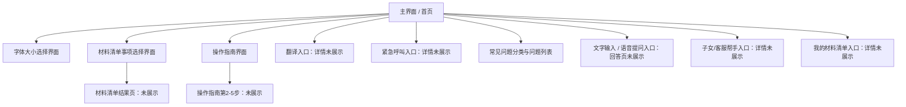

# 粤同心-湾区中老年助手：界面与交互逻辑说明

## 1. 文档说明

本文档基于当前已提供的灵光闪应用截图整理，记录《粤同心-湾区中老年助手》的界面结构、页面元素、用户操作路径与可见交互逻辑。

### 1.1 已纳入整理的页面

本次只整理截图中已经展示的页面与区域，包括：

1. 主界面 / 首页
2. 字体大小选择界面
3. 材料清单事项选择界面
4. 操作指南部分界面（当前仅展示第 1 / 5 步）

### 1.2 暂不纳入的内容

以下内容虽然在主界面中出现了入口，但未提供对应展开页或结果页截图，因此本文只记录其入口位置与可见交互，不展开具体页面逻辑：

1. 翻译功能详情页
2. 紧急呼叫详情页
3. 子女 / 客服帮手详情页
4. 我的材料清单详情页
5. 常见问题点击后的回答页
6. 文字提问 / 语音提问后的 AI 回复页
7. AI 朗读播放后的具体反馈状态
8. 材料清单生成后的结果页

---

## 2. 产品定位

项目名称：**粤同心-湾区中老年助手**

页面副标题：**您的智能生活帮手**

根据当前界面，该应用定位为面向湾区中老年用户的智能辅助工具，主要围绕以下场景展开：

1. 港澳出行与通关相关问题咨询
2. 材料清单查询与准备
3. 普通话 / 粤语相关辅助
4. 紧急联系与家属协助
5. 面向老年用户的适老化字体与操作引导

---

## 3. 整体界面结构

当前主界面采用纵向滚动布局，主要由以下区域组成：

```text
顶部标题区
↓
全局偏好设置区
↓
助手介绍与功能说明卡片
↓
核心功能入口按钮区
↓
常见问题区
↓
文字输入与语音提问区
↓
辅助入口区
```

界面整体风格以蓝色为主色，配合绿色、橙色、红色等颜色区分不同功能入口。按钮尺寸较大，文字字号偏大，符合适老化应用的基本方向。

---

## 4. 主界面说明

### 4.1 页面用途

主界面是用户进入应用后的核心入口页面，用于完成：

1. 设置语言、地区、方向等查询偏好
2. 查看助手能力说明
3. 进入材料清单、翻译、紧急呼叫等功能
4. 浏览常见问题
5. 通过文字或语音方式向 AI 提问
6. 进入字体设置、操作指南等辅助功能

---

### 4.2 顶部标题区

#### 可见元素

| 元素 | 内容 / 状态 |
|---|---|
| 应用标题 | 粤同心-湾区中老年助手 |
| 副标题 | 您的智能生活帮手 |
| 字体按钮 | 位于右上角，按钮文案为“字体” |

#### 交互逻辑

| 用户操作 | 预期结果 |
|---|---|
| 点击“字体”按钮 | 进入或弹出字体大小选择界面 |

---

### 4.3 全局偏好设置区

#### 可见元素

顶部设置区包含三组筛选 / 偏好选项：

| 设置项 | 可选项 | 当前可见选中状态 |
|---|---|---|
| 播报语言 | 普通话 / 粤语 | 普通话 |
| 目的地 / 出发地 | 香港 / 澳门 / 全部 | 全部 |
| 方向 | 去往港澳 / 返回内地 / 全部 | 全部 |

#### 交互逻辑

| 用户操作 | 预期结果 |
|---|---|
| 点击“普通话” | 将播报语言设置为普通话 |
| 点击“粤语” | 将播报语言设置为粤语 |
| 点击“香港” | 将目的地 / 出发地筛选为香港 |
| 点击“澳门” | 将目的地 / 出发地筛选为澳门 |
| 点击“全部” | 取消单一地区筛选，使用全部地区 |
| 点击“去往港澳” | 将方向筛选为去往港澳 |
| 点击“返回内地” | 将方向筛选为返回内地 |
| 点击“全部” | 取消单一方向筛选，使用全部方向 |

#### 状态说明

1. 被选中的按钮以白底深色字显示。
2. 未选中的按钮为半透明或浅色边框样式。
3. 这些设置属于全局状态，可能会影响后续常见问题展示、材料清单生成、AI 回答内容和语音播报语言。

---

### 4.4 助手介绍与功能说明卡片

#### 可见元素

卡片标题：

```text
👋 您好！我是粤同心-湾区中老年助手智能体
```

能力说明：

```text
我可以直接帮您：
```

可见功能说明包括：

1. 准备过关材料
2. 翻译粤语普通话
3. 紧急联系家人
4. 输入问题或点击下方按钮语音提问
5. 点击播放按钮听 AI 朗读回复

卡片底部包含按钮：

```text
📖 查看操作指南
```

#### 交互逻辑

| 用户操作 | 预期结果 |
|---|---|
| 点击“查看操作指南” | 打开操作指南界面，显示分步使用说明 |

---

### 4.5 核心功能入口区

#### 可见按钮

| 按钮 | 颜色 | 当前文案 |
|---|---|---|
| 材料清单 | 绿色 | 📋 材料清单 |
| 翻译 | 蓝色 | 🌐 翻译 |
| 紧急呼叫 | 橙色 | 🆘 紧急呼叫 |

#### 交互逻辑

| 用户操作 | 预期结果 |
|---|---|
| 点击“材料清单” | 进入材料清单事项选择界面 |
| 点击“翻译” | 进入翻译功能；详情页未提供，本文不展开 |
| 点击“紧急呼叫” | 进入紧急呼叫功能；详情页未提供，本文不展开 |

---

### 4.6 常见问题区

#### 可见元素

区域标题：

```text
💡 常见问题
```

分类筛选按钮：

1. 全部
2. 证件办理
3. 通关流程
4. 交通出行
5. 政策福利
6. 医疗健康

当前可见问题：

```text
如何申请港澳通行证？
```

提示文案：

```text
👆 点击上方问题快速提问，或使用语音输入其他问题
```

#### 交互逻辑

| 用户操作 | 预期结果 |
|---|---|
| 点击“全部” | 展示全部常见问题 |
| 点击“证件办理” | 展示证件办理类问题 |
| 点击“通关流程” | 展示通关流程类问题 |
| 点击“交通出行” | 展示交通出行类问题 |
| 点击“政策福利” | 展示政策福利类问题 |
| 点击“医疗健康” | 展示医疗健康类问题 |
| 点击具体问题 | 将该问题作为提问内容，触发问答；回答页未提供，本文不展开 |

#### 状态说明

1. 当前选中的分类按钮使用蓝色背景。
2. 未选中的分类按钮为白色或浅色按钮样式。
3. 问题以卡片形式展示，便于老年用户直接点击提问。

---

### 4.7 文字输入与语音提问区

#### 可见元素

| 元素 | 内容 / 状态 |
|---|---|
| 输入框 | 占位提示为“请输入您的问题...” |
| 发送按钮 | 文案为“发送”，当前呈灰色状态 |
| 语音按钮 | 🎤 语音提问 |

#### 交互逻辑

| 用户操作 | 预期结果 |
|---|---|
| 在输入框输入问题 | 输入框展示用户输入内容 |
| 点击“发送” | 提交文字问题并触发 AI 问答；回答页未提供，本文不展开 |
| 点击“语音提问” | 启动语音输入流程；语音识别结果页或回答页未提供，本文不展开 |

#### 状态说明

1. 截图中“发送”按钮呈灰色，推测在输入框为空时为不可用或弱激活状态。
2. 当用户输入文字后，“发送”按钮应切换为可点击状态。
3. “语音提问”按钮为深蓝色大按钮，是主推荐提问方式之一。

---

### 4.8 底部辅助入口区

#### 可见按钮

| 按钮 | 颜色 | 当前文案 |
|---|---|---|
| 子女 / 客服帮手 | 红色 | 📞 子女/客服帮手 |
| 我的材料清单 | 绿色 | 📋 我的材料清单 |

#### 交互逻辑

| 用户操作 | 预期结果 |
|---|---|
| 点击“子女/客服帮手” | 进入子女或客服协助功能；详情页未提供，本文不展开 |
| 点击“我的材料清单” | 进入已保存材料清单；详情页未提供，本文不展开 |

---

## 5. 字体大小选择界面说明

### 5.1 页面用途

字体大小选择界面用于调整应用的显示字号，服务于中老年用户的适老化阅读需求。

---

### 5.2 可见元素

页面标题：

```text
选择字体大小
```

说明文案：

```text
请选择适合您的字体大小
```

字体选项：

| 选项 | 显示内容 | 当前状态 |
|---|---|---|
| 小字体 | 小 / 小字体 | 未选中 |
| 中字体 | 中 / 中字体 | 未选中 |
| 大字体 | 大 / 大字体 | 已选中 |
| 超大字体 | 超大 / 超大字体 | 未选中 |

---

### 5.3 交互逻辑

| 用户操作 | 预期结果 |
|---|---|
| 点击“小字体” | 应用切换为小字号显示 |
| 点击“中字体” | 应用切换为中字号显示 |
| 点击“大字体” | 应用切换为大字号显示 |
| 点击“超大字体” | 应用切换为超大字号显示 |

### 5.4 状态说明

1. 当前选中项使用蓝色背景高亮。
2. 当前截图中“大字体”为选中状态。
3. 字体设置应作为全局显示偏好，影响主界面、材料清单、操作指南等页面的文字大小。
4. 建议在实际实现中保存用户选择，避免用户每次打开应用都重新设置。

---

## 6. 材料清单事项选择界面说明

### 6.1 页面用途

材料清单界面用于让用户选择自己要办理的事项。用户选择事项后，系统应生成对应的材料清单。

---

### 6.2 可见元素

页面标题：

```text
📋 请选择要办理的事项
```

说明文案：

```text
选择后，我会为您生成对应的材料清单
```

可见事项卡片：

| 事项 | 图标 / 文案 |
|---|---|
| 办理港澳通行证 | 🪪 办理港澳通行证 |
| 港澳通行证续签 | 🔁 港澳通行证续签 |
| 社保医保转移 | 💼 社保医保转移 |
| 老年证办理 | 👴 老年证办理 |
| 老年补贴申请 | 💰 老年补贴申请 |
| 过关材料准备 | 🧳 过关材料准备 |

---

### 6.3 交互逻辑

| 用户操作 | 预期结果 |
|---|---|
| 点击“办理港澳通行证” | 选择该事项，并生成办理港澳通行证所需材料清单 |
| 点击“港澳通行证续签” | 选择该事项，并生成续签所需材料清单 |
| 点击“社保医保转移” | 选择该事项，并生成社保医保转移所需材料清单 |
| 点击“老年证办理” | 选择该事项，并生成老年证办理所需材料清单 |
| 点击“老年补贴申请” | 选择该事项，并生成老年补贴申请所需材料清单 |
| 点击“过关材料准备” | 选择该事项，并生成过关准备材料清单 |

### 6.4 状态说明

1. 当前截图只展示事项选择页，没有展示材料清单生成后的结果页。
2. 事项卡片采用两列网格布局，卡片面积较大，便于点击。
3. 卡片整体为浅灰色，当前截图未展示选中状态或生成结果。

---

## 7. 操作指南界面说明

### 7.1 页面用途

操作指南用于帮助中老年用户理解如何使用应用。当前展示的是分步引导页面中的第 1 步。

---

### 7.2 可见元素

页面标题：

```text
📖 操作指南
```

当前步骤内容：

| 元素 | 内容 |
|---|---|
| 步骤图片 | 键盘与 question 标识的示意图 |
| 步骤标题 | 第一步：点击语音提问 |
| 步骤说明 | 点击底部蓝色“语音提问”按钮，说出您的问题 |
| 轮播进度点 | 共 5 步，当前为第 1 步 |
| 步骤计数 | 1 / 5 |
| 上一步按钮 | 当前灰色，疑似不可用 |
| 下一步按钮 | 蓝色，可点击 |
| 关闭按钮 | 位于底部 |

---

### 7.3 交互逻辑

| 用户操作 | 预期结果 |
|---|---|
| 点击“下一步” | 切换到第 2 步操作说明 |
| 点击“上一步” | 返回上一条操作说明；当前第 1 步时不可用 |
| 点击“关闭” | 关闭操作指南，返回主界面 |
| 点击进度点 | 可能切换到对应步骤；截图未明确展示该交互是否可用 |

### 7.4 状态说明

1. 当前步骤为 1 / 5。
2. “上一步”按钮处于灰色状态，符合首步不可返回的交互逻辑。
3. “下一步”按钮为主要操作按钮。
4. 当前只提供第 1 步截图，因此第 2 至第 5 步内容暂不记录。

---

## 8. 当前可见页面导航关系



---

## 9. 当前可见核心用户流程

### 9.1 调整字体流程

```text
用户进入主界面
→ 点击右上角“字体”
→ 进入字体大小选择界面
→ 选择小字体 / 中字体 / 大字体 / 超大字体
→ 当前选项高亮
→ 应用界面字号随之变化
```

---

### 9.2 查看材料清单流程

```text
用户进入主界面
→ 点击“材料清单”
→ 进入“请选择要办理的事项”页面
→ 点击具体办理事项
→ 系统生成对应材料清单
```

说明：当前截图未展示生成后的材料清单结果页，因此本文只记录到“选择办理事项”这一步。

---

### 9.3 查看操作指南流程

```text
用户进入主界面
→ 点击“查看操作指南”
→ 打开操作指南页面
→ 默认显示第 1 / 5 步
→ 点击“下一步”浏览后续步骤
→ 点击“关闭”返回主界面
```

说明：当前截图只展示第 1 / 5 步，后续步骤内容暂不记录。

---

### 9.4 常见问题快速提问流程

```text
用户进入主界面
→ 在“常见问题”区域选择问题分类
→ 点击具体问题，例如“如何申请港澳通行证？”
→ 系统将该问题作为提问内容
→ 触发 AI 问答
```

说明：当前截图未展示 AI 回复结果页，因此本文只记录到“触发提问”这一步。

---

### 9.5 文字 / 语音提问流程

```text
用户进入主界面
→ 在输入框输入问题，或点击“语音提问”
→ 系统接收用户问题
→ 触发 AI 问答
```

说明：当前截图未展示语音识别过程、AI 回复内容与播报状态，因此本文不展开后续逻辑。

---

## 10. 可见状态与数据项整理

### 10.1 全局状态

| 状态名 | 可见取值 | 当前状态 |
|---|---|---|
| 播报语言 | 普通话 / 粤语 | 普通话 |
| 地区范围 | 香港 / 澳门 / 全部 | 全部 |
| 出行方向 | 去往港澳 / 返回内地 / 全部 | 全部 |
| 字体大小 | 小 / 中 / 大 / 超大 | 大 |

### 10.2 页面状态

| 页面 | 状态项 | 说明 |
|---|---|---|
| 主界面 | FAQ 分类选中项 | 当前为“全部” |
| 主界面 | 输入框状态 | 当前为空 |
| 主界面 | 发送按钮状态 | 当前为灰色，疑似不可用 |
| 字体界面 | 字体选中项 | 当前为“大字体” |
| 操作指南 | 当前步骤 | 1 / 5 |
| 操作指南 | 上一步按钮 | 当前不可用或弱激活 |

---

## 11. 适老化设计体现

当前界面已体现出多项适老化设计：

1. **大按钮设计**：核心功能入口均为大面积按钮，降低误触难度。
2. **大字号倾向**：主界面文字整体较大，并提供单独字体设置。
3. **语音优先**：主界面强调“语音提问”，符合中老年用户输入习惯。
4. **操作指南**：提供图文分步指引，降低首次使用门槛。
5. **高对比配色**：深蓝色按钮与浅色背景对比明显。
6. **分类清晰**：材料清单、翻译、紧急呼叫等功能入口区分明确。
7. **家属协助入口**：提供“子女/客服帮手”，符合真实使用场景。

---

## 12. 当前界面中的待确认点

以下内容需要后续页面截图或功能说明才能继续整理：

1. “翻译”按钮点击后的页面结构
2. “紧急呼叫”按钮点击后的联系人选择与拨打逻辑
3. “子女/客服帮手”的具体协助方式
4. “我的材料清单”的保存、勾选与查看逻辑
5. 点击常见问题后的 AI 回复展示样式
6. 输入文字并发送后的回复流程
7. 点击“语音提问”后的录音、识别、确认与回答流程
8. 点击“播放按钮”后的语音播报状态
9. 材料事项选择后生成材料清单的结果页
10. 操作指南第 2 至第 5 步内容

---

## 13. 当前版本页面清单

| 页面 / 区域 | 是否已提供截图 | 本文是否整理 |
|---|---:|---:|
| 主界面顶部设置区 | 是 | 是 |
| 主界面助手说明卡片 | 是 | 是 |
| 主界面功能入口 | 是 | 是 |
| 常见问题区 | 是 | 是 |
| 输入与语音提问区 | 是 | 是 |
| 字体大小选择界面 | 是 | 是 |
| 材料清单事项选择界面 | 是 | 是 |
| 操作指南第 1 步 | 是 | 是 |
| 翻译详情页 | 否 | 否 |
| 紧急呼叫详情页 | 否 | 否 |
| 我的材料清单详情页 | 否 | 否 |
| AI 回复结果页 | 否 | 否 |
| 材料清单结果页 | 否 | 否 |
| 操作指南第 2-5 步 | 否 | 否 |

---

## 14. 小结

当前已展示页面能够构成一个较完整的中老年智能助手首页原型，核心能力入口清楚，适老化特征明显。已明确展示的功能包括：

1. 语言、地区、方向筛选
2. 字体大小设置
3. 材料清单事项选择
4. 常见问题快速提问
5. 文字输入与语音提问入口
6. 操作指南第 1 步
7. 翻译、紧急呼叫、子女 / 客服帮手、我的材料清单等功能入口

后续若继续补充截图，可在本文基础上追加对应模块，不需要重写整体结构。
