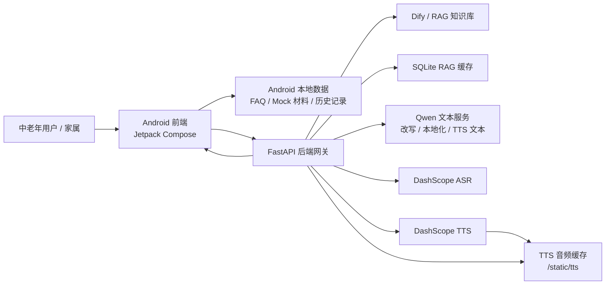
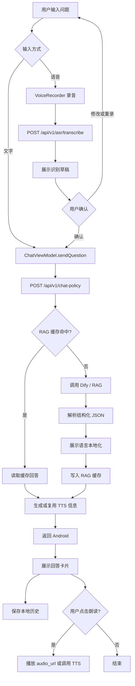

# 01 系统架构说明

## 1. 文档目的

本文档用于说明当前仓库中“粤同心-湾区中老年助手 / Elderly Service Assistant”的系统架构、核心请求链路、已实现范围、mock 范围和待确认事项，便于作为课程或项目最终提交材料使用。

本文档基于当前仓库中的 README、`backend`、`ElderCareApp`、`dify-config`、`docs/phase`、UI 盘点文档及相关源码整理。未在当前仓库中明确发现的内容，统一标注为“待确认”或“当前仓库中未明确发现”。

## 2. 项目整体架构

当前项目由以下部分组成：

- Android 前端：位于 `ElderCareApp/`，使用 Jetpack Compose 构建首页、问答页、服务页、我的页、FAQ 详情、材料清单、语音输入与朗读等交互。
- FastAPI 后端：位于 `backend/`，作为 Android 与 Dify、DashScope ASR/TTS、Qwen 文本服务之间的后端网关。
- Dify / RAG 知识库：配置与知识库样例位于 `dify-config/`，后端通过 Dify Chat API 获取政策问答结果，并解析结构化 JSON。
- ASR / TTS 语音能力：Android 负责录音与播放，后端负责接入 DashScope ASR 与 TTS，并缓存 TTS 音频。
- 本地数据模块：Android 端包含 FAQ 静态数据、本地材料清单 mock、本地历史记录；后端也包含材料清单静态服务和 RAG SQLite 缓存。

## 3. 架构分层说明

### Android 前端层

Android 前端主要承担用户界面、交互状态、录音、播放、请求后端和本地轻量存储。

相关文件包括：

- `ElderCareApp/app/src/main/java/com/example/eldercareapp/MainActivity.kt`
- `ElderCareApp/app/src/main/java/com/example/eldercareapp/ui/screen/ElderCareScreens.kt`
- `ElderCareApp/app/src/main/java/com/example/eldercareapp/ui/screen/FaqData.kt`
- `ElderCareApp/app/src/main/java/com/example/eldercareapp/viewmodel/ChatViewModel.kt`
- `ElderCareApp/app/src/main/java/com/example/eldercareapp/viewmodel/MaterialViewModel.kt`
- `ElderCareApp/app/src/main/java/com/example/eldercareapp/api/AssistantApi.kt`
- `ElderCareApp/app/src/main/java/com/example/eldercareapp/api/ApiClient.kt`
- `ElderCareApp/app/src/main/java/com/example/eldercareapp/voice/VoiceRecorder.kt`
- `ElderCareApp/app/src/main/java/com/example/eldercareapp/data/local/ChatHistoryStorage.kt`
- `ElderCareApp/app/src/main/java/com/example/eldercareapp/core/i18n/AppLanguageResolver.kt`

当前前端已形成 Home / Chat / Service / My 四个主 Tab，以及多个覆盖页状态。当前导航主要通过 Compose state 切换，未使用 `NavHost`。

### FastAPI 后端层

FastAPI 后端负责统一封装外部模型和 Dify 调用，避免 Android 直接保存或调用 Dify、DashScope、Qwen 等 API Key。

相关文件包括：

- `backend/app/main.py`
- `backend/app/config.py`
- `backend/app/api/routes_chat.py`
- `backend/app/api/routes_asr.py`
- `backend/app/api/routes_tts.py`
- `backend/app/api/routes_materials.py`
- `backend/app/api/routes_health.py`
- `backend/app/schemas/chat_schema.py`
- `backend/app/schemas/asr_schema.py`
- `backend/app/schemas/tts_schema.py`
- `backend/app/schemas/material_schema.py`

当前后端已注册 `chat`、`asr`、`tts`、`materials`、`health` 路由，并将 TTS 音频缓存目录挂载到 `/static/tts`。

### Dify / RAG 知识库层

Dify / RAG 层用于支撑政策类问答，尤其是港澳通行证、签注办理、费用、时限、商务签注、过关材料等问答场景。

相关文件包括：

- `backend/app/services/dify_service.py`
- `backend/app/services/rag_cache_service.py`
- `backend/app/services/display_localization_service.py`
- `backend/app/services/qwen_text_service.py`
- `dify-config/apps/policy_qa_prompt_structured_json.md`
- `dify-config/knowledge-base/政务办事_港澳通行证办理知识库.md`
- `dify-config/knowledge-base/sample_docs/hk_macau_permit_faq.md`
- `backend/tests/rag_cases_hk_macau_permit.json`

后端 `/api/v1/chat-policy` 会调用 Dify，解析结构化 JSON，并返回 `display_text`、`structured_answer`、`sources`、`tts` 等字段。后端还实现了 SQLite RAG 答案缓存。

### ASR / TTS 语音层

语音层分为语音输入和语音朗读：

- Android 使用 `VoiceRecorder` 通过 `MediaRecorder` 录制 `.m4a` 音频。
- Android 通过 Retrofit multipart 调用后端 `/api/v1/asr/transcribe`。
- 后端 `asr_service.py` 调用 DashScope 兼容接口进行语音识别。
- 后端 `tts_service.py` 调用 DashScope TTS 服务生成音频，并缓存到 `backend/app/data/audio_cache`。
- Android 优先播放问答响应中的 `tts.audio_url`；没有音频 URL 时可调用 `/api/v1/tts/synthesize`。

相关文件包括：

- `ElderCareApp/app/src/main/java/com/example/eldercareapp/voice/VoiceRecorder.kt`
- `ElderCareApp/app/src/main/java/com/example/eldercareapp/viewmodel/ChatViewModel.kt`
- `backend/app/api/routes_asr.py`
- `backend/app/api/routes_tts.py`
- `backend/app/services/asr_service.py`
- `backend/app/services/tts_service.py`
- `backend/app/services/qwen_text_service.py`

### 本地数据与历史记录层

本地数据包括：

- Android 本地 FAQ 静态详情数据：`FaqData.kt`
- Android 本地材料清单 mock：`MaterialViewModel.kt`
- Android 本地问答历史：`ChatHistoryStorage.kt`，使用 SharedPreferences 保存最多 30 条历史。
- 后端材料清单静态服务：`material_service.py`
- 后端 RAG SQLite 缓存：`rag_cache_service.py`

需要注意：材料清单前端当前主要使用本地 mock；后端材料接口已存在，但根据 `docs/ui-inventory-current.md` 和 `MaterialViewModel.kt`，当前 UI 未明确使用后端材料接口作为主要数据源。

## 4. 核心请求链路

### 用户文本提问链路

1. 用户在 Chat 页输入问题。
2. `ChatViewModel.sendQuestion()` 构造 `ChatPolicyRequest`。
3. `AssistantApi.chatPolicy()` 调用后端 `POST /api/v1/chat-policy`。
4. 后端进行显示语言与朗读语言归一化。
5. 后端查询 RAG 缓存；命中时返回缓存结果并继续处理 TTS。
6. 未命中时后端调用 Dify 获取回答。
7. 后端解析结构化回答、本地化展示文本、生成或复用 TTS 信息。
8. Android 展示结构化回答卡片或普通回答卡片。
9. 成功问答写入本地历史记录。

### 用户语音提问链路

1. 用户在 Chat 页点击语音按钮。
2. Android 申请麦克风权限并通过 `VoiceRecorder` 录制 `.m4a`。
3. `ChatViewModel.transcribeVoice()` 上传音频到 `POST /api/v1/asr/transcribe`。
4. 后端通过 `asr_service.py` 调用 DashScope ASR。
5. Android 展示“我听到的是”识别草稿。
6. 用户确认后，`ChatViewModel.confirmVoiceDraft()` 以 `input_type = voice` 进入文本问答链路。

### RAG 问答链路

1. 后端 `routes_chat.py` 接收用户问题。
2. 使用 `rag_cache_service.py` 构造缓存 key。
3. 缓存命中时返回缓存中的文本和结构化内容，跳过 Dify。
4. 缓存未命中时调用 `dify_service.py` 的 Dify Chat API。
5. `parse_structured_answer()` 尝试解析 Dify 返回的结构化 JSON。
6. `display_localization_service.py` 根据展示语言处理动态内容本地化。
7. 响应返回 Android，并在允许缓存时写入 RAG 缓存。

### TTS 朗读链路

1. 后端问答响应中返回 `tts.text` 和可选 `tts.audio_url`。
2. Android 朗读回答时优先播放已有 `tts.audio_url`。
3. 若无音频 URL，Android 调用 `POST /api/v1/tts/synthesize`。
4. 后端通过 `tts_service.py` 生成音频并写入音频缓存。
5. 音频通过 `/static/tts/...` 提供给 Android 播放。

### FAQ 静态详情链路

1. 首页 FAQ 数据来自 Android 本地 `FaqData.kt`。
2. 用户点击 FAQ 后进入 `FaqDetailScreen`。
3. FAQ 详情页展示本地 `shortAnswer`、`answerSections`、`tips`、`sourceNote`、`updatedAt`。
4. 用户需要个性化咨询时点击“继续追问”。
5. 系统再调用 `ChatViewModel.submitPrefilledQuestion()` 进入 RAG 问答链路。

当前代码中已发现 `FaqDetailScreen`，说明 FAQ 已从“点击即问答”调整为“先看本地详情，再继续追问”。

### 本地历史记录链路

1. 成功完成问答后，`ChatViewModel.saveSuccessfulHistoryItem()` 生成历史记录。
2. `ChatHistoryStorage` 使用 SharedPreferences 保存 JSON。
3. 历史记录最多保留 30 条。
4. Chat 页历史 BottomSheet 支持恢复、重新提问、删除和清空。
5. 恢复历史不触发网络请求；重新提问会重新进入问答链路。

## 5. Mermaid 架构图

## 6. Mermaid 流程图

## 7. 当前实现状态

| 模块 | 当前状态 | 说明 |
| --- | --- | --- |
| Android 前端主框架 | 已实现 | Home / Chat / Service / My 主 Tab 与覆盖页状态已存在。 |
| 首页服务入口 | 已实现主体 | 首页、口岸概览、FAQ、材料入口存在，部分人工帮助入口为 Toast。 |
| 智能问答 | 已接入 | Chat 页调用后端 `/api/v1/chat-policy`，支持结构化回答展示。 |
| Dify / RAG | 已接入 | 后端调用 Dify Chat API；需配置真实 Dify Key 和服务地址。 |
| RAG 缓存 | 已实现 | 后端 SQLite RAG 缓存已存在，包含 TTL、版本 key、命中逻辑。 |
| ASR 语音识别 | 已接入 | Android 录音，后端调用 DashScope ASR；真实效果依赖 Key 与网络。 |
| TTS 语音朗读 | 已接入 | 后端 TTS 合成与音频缓存已存在，Android 播放音频 URL。 |
| 展示语言跟随系统 | 部分实现 | `AppLanguageResolver` 根据系统 Locale 映射 `zh-CN`、`zh-HK`、`en`。 |
| 朗读语言独立选择 | 已实现入口 | 首页可选择朗读语言偏好，影响 Chat/Guide/Guidance 的 TTS language。 |
| FAQ 静态详情页 | 已实现 | `FaqData.kt` 与 `FaqDetailScreen` 已存在。 |
| 本地历史记录 | 已实现 MVP | SharedPreferences 保存最多 30 条问答历史。 |
| 口岸信息 | Mock / 静态演示 | 口岸列表和详情为本地静态数据，非实时口岸接口。 |
| 养老服务入口 | 静态原型 | 本地静态服务类型和机构详情，部分操作为 Toast。 |
| 材料清单 | Mock MVP | 前端主要使用本地 mock，后端静态材料接口存在但当前 UI 未明确主用。 |
| 真实政务数据源 | 待确认 | 当前仓库中未明确发现真实政务数据 API 接入。 |

## 8. 当前状态总结

当前项目已经形成 Android 前端、FastAPI 后端、Dify/RAG 问答、ASR/TTS 语音能力、多语言展示、本地 FAQ、本地历史记录和材料清单 mock 的基本闭环。系统适合作为课程项目或 Demo 展示，但仍需明确区分真实能力与演示数据：RAG 问答、ASR、TTS 依赖外部配置和服务；口岸、养老服务、材料清单当前多为本地静态或 mock；政策来源链接、真实口岸接口、正式数据更新机制仍需后续补充。
