# 界面说明

## 首页

### 首页主界面

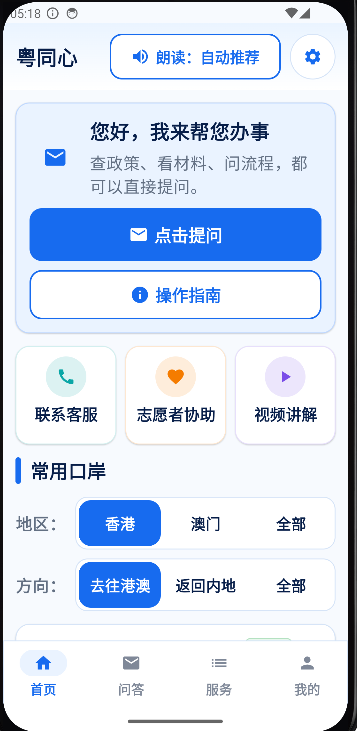
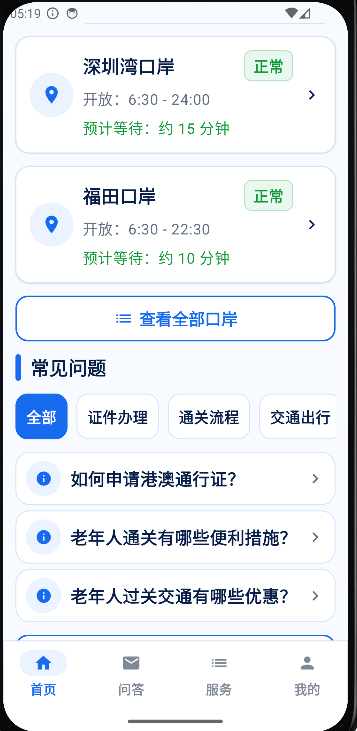

### 字体调整页

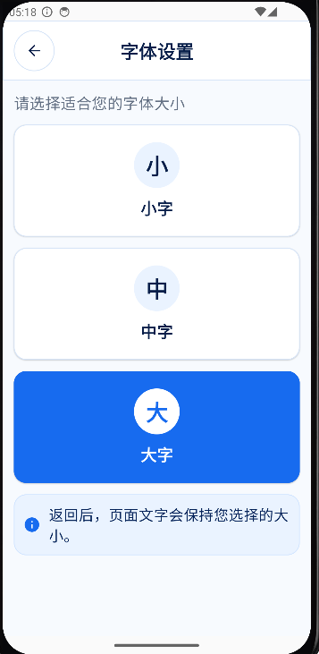

### 朗读语音选择页

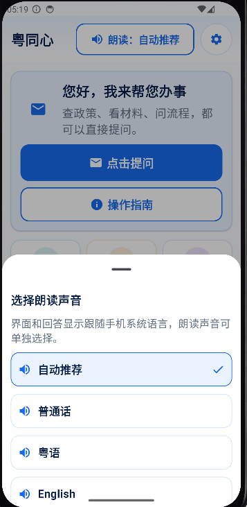

### 操作指南页

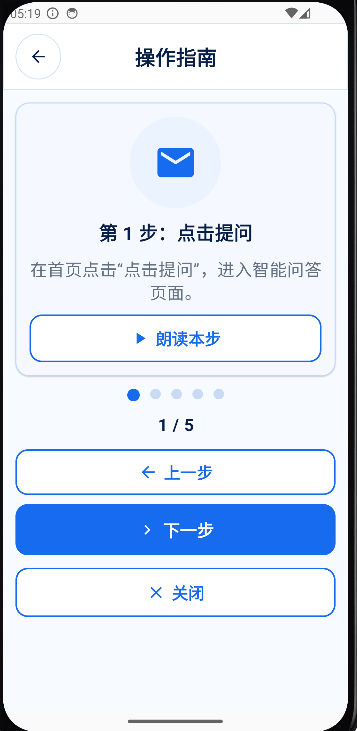

### 口岸详细页

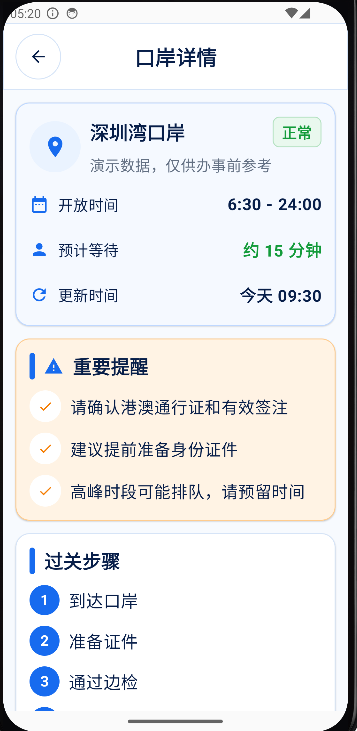
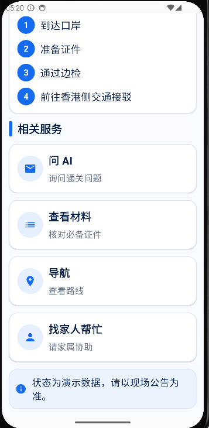

### 常见问题详细页

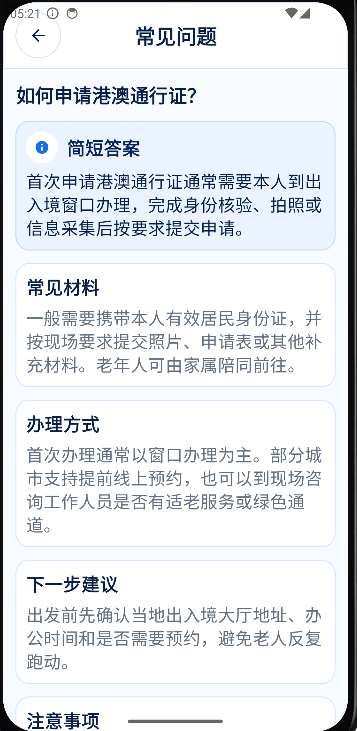
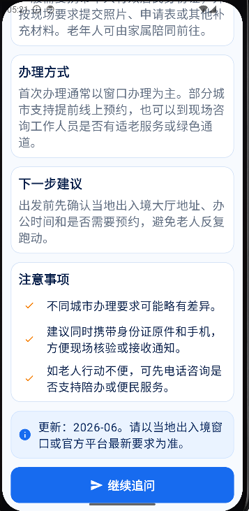

## 问答

### 智能问答主页

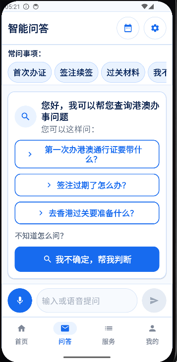

### 语音输入页

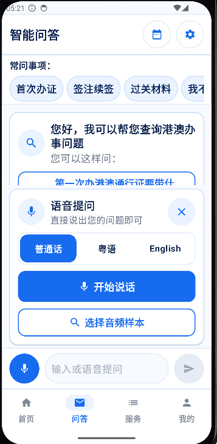

### 问题回复页

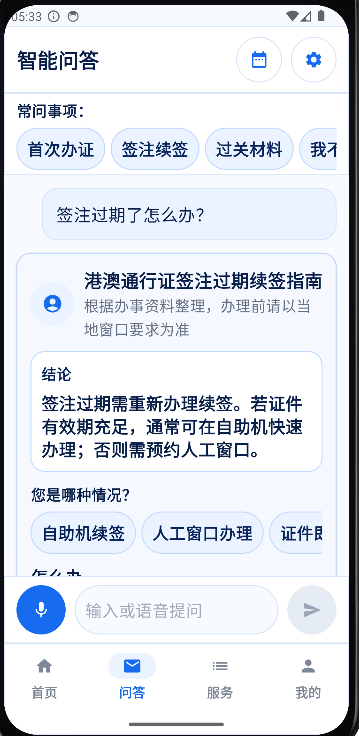
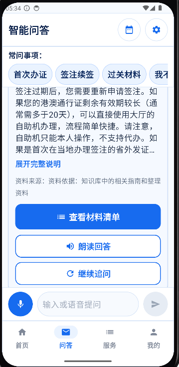

### 历史记录页

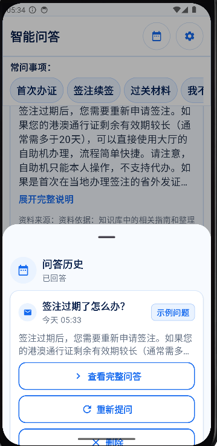

## 服务

### 服务页主界面

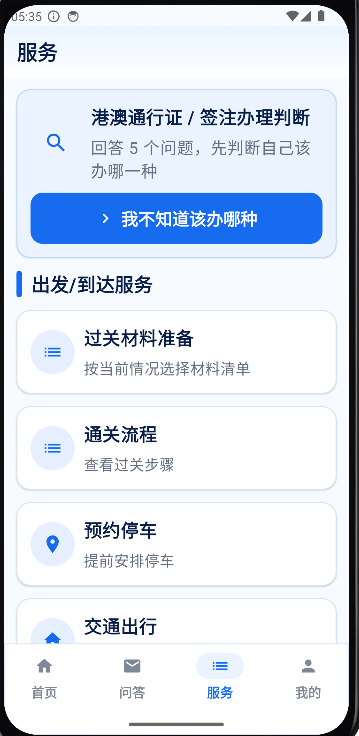

### 过关材料准备判断页

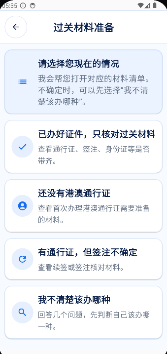
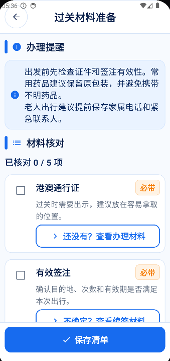
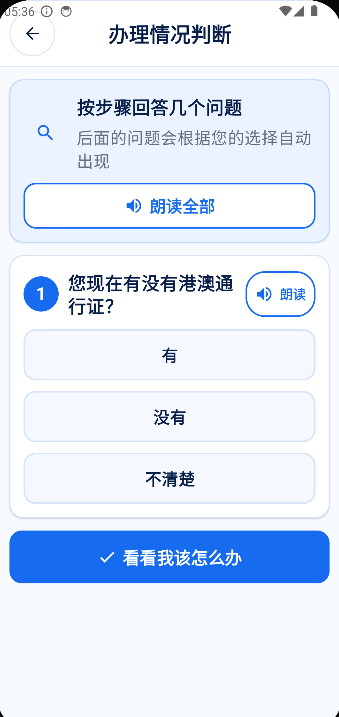

## 主页

### 我的材料清单页

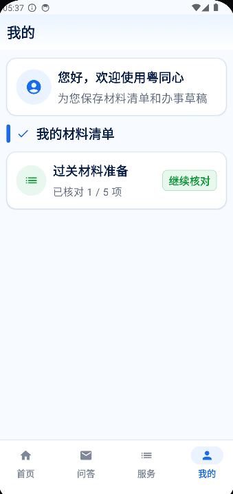

## Dify Workflow

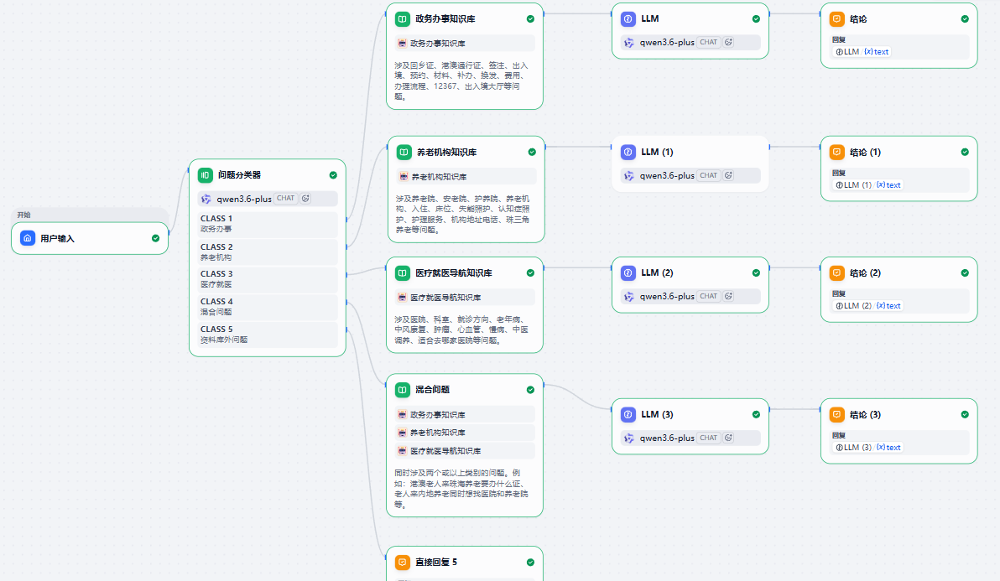
